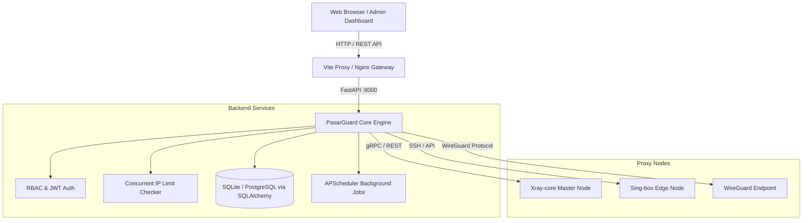

<p align="center">
  <a href="https://github.com/baglanemelian/pasarguard" target="_blank" rel="noopener noreferrer">
    <picture>
      <source media="(prefers-color-scheme: dark)" srcset="https://github.com/PasarGuard/PasarGuard.github.io/raw/main/public/logos/PasarGuard-white-logo.png">
      
    </picture>
  </a>
</p>

<h1 align="center">🛡️ PasarGuard — Next-Gen Proxy Orchestration Panel</h1>

<p align="center">
  <strong>Unified, censorship-resistant multi-node proxy management suite with real-time telemetry, concurrent IP enforcement, and reseller quota controls.</strong>
</p>

<p align="center">
  <a href="https://github.com/baglanemelian/pasarguard"></a>
  <a href="https://github.com/baglanemelian/pasarguard"></a>
  <a href="https://github.com/baglanemelian/pasarguard"></a>
  <a href="https://github.com/baglanemelian/pasarguard"></a>
  <a href="https://github.com/baglanemelian/pasarguard"></a>
  <a href="https://github.com/baglanemelian/pasarguard"></a>
</p>

<p align="center">
  <a href="#-key-features">✨ Features</a> •
  <a href="#-quick-start">🚀 Quick Start</a> •
  <a href="#-system-architecture">⚙️ Architecture</a> •
  <a href="#-rest-api--swagger">📖 REST API</a> •
  <a href="#-custom-enhancements">💎 Custom Mods</a> •
  <a href="#-contributing">🤝 Contributing</a>
</p>

<p align="center">
  
</p>

---

## 🌟 Key Features

<table>
  <tr>
    <td width="50%">
      <h3>🔒 Multi-Protocol Engine</h3>
      Seamlessly orchestrate <b>Xray</b>, <b>Sing-box</b>, and <b>WireGuard</b> cores. Supports <code>VLESS</code>, <code>VMess</code>, <code>Trojan</code>, <code>Shadowsocks</code>, <code>Hysteria 2</code>, and <code>TUIC</code>.
    </td>
    <td width="50%">
      <h3>⚡ Concurrent IP Limit (UUID Level)</h3>
      Real-time background security service that monitors active connections per user UUID and blocks unauthorized multi-device credential sharing.
    </td>
  </tr>
  <tr>
    <td width="50%">
      <h3>👥 Reseller & Sub-Admin Quotas</h3>
      Granular Role-Based Access Control (RBAC). Assign custom user limits (<code>max_users</code>) to resellers and monitor sub-admin usage in real-time.
    </td>
    <td width="50%">
      <h3>📊 Live Telemetry & Node Health</h3>
      Sub-second live bandwidth metrics, CPU/RAM/Disk consumption, latency tests, node uptime, and active connection tracking with interactive Recharts.
    </td>
  </tr>
  <tr>
    <td width="50%">
      <h3>🎨 Modern Responsive Dashboard</h3>
      Built with <b>React 19</b>, <b>Tailwind CSS v4</b>, and <b>Radix UI</b> primitives. Supports customizable themes, Dark/Light modes, RTL layouts, and mobile optimization.
    </td>
    <td width="50%">
      <h3>🤖 Telegram Bot & Webhooks</h3>
      Automated backup dispatch, quota exhaustion warnings, node offline alerts, and subscription renewal notifications directly via Telegram.
    </td>
  </tr>
</table>

---

## 💎 Custom Enhancements in this Fork

This repository contains custom production enhancements built on top of the original PasarGuard panel:

- [x] **Concurrent IP Multi-Device Limiter:** Added `uuid_limit` database column, UI inputs in user creation/edit forms, and an automated background inspector (`ip_limit_checker.py`).
- [x] **Sub-Admin / Reseller Quota Enforcement:** Strict user creation limits per reseller (`max_users`) to prevent quota overrun.
- [x] **Vite Reverse Proxy & Dev Experience:** Native single-origin API proxy configuration eliminating CORS issues during development.
- [x] **Windows & Linux Dual-Platform Ready:** Full Windows native support with instant batch launcher scripts (`start-all.bat`).

---

## 🚀 Quick Start

### 🪟 Windows (Local Development & Testing)

This repository includes one-click batch scripts to get up and running instantly:

```bash
# 1. Clone the repository
git clone https://github.com/baglanemelian/pasarguard.git
cd pasarguard

# 2. Run both Backend & Frontend with one click
./start-all.bat
```

Alternatively, run services individually:
- `run-backend.bat` — Starts the FastAPI backend daemon on `http://127.0.0.1:8000`
- `run-frontend-dev.bat` — Starts the React Vite dev server on `http://localhost:5173`
- `build-frontend.bat` — Compiles and bundles production frontend assets

---

### 🐧 Linux (Server Deployment)

```bash
# Clone and enter directory
git clone https://github.com/baglanemelian/pasarguard.git
cd pasarguard/panel

# Install dependencies using uv
uv sync

# Run database migrations
uv run alembic upgrade head

# Start production server
uv run python main.py
```

---

## 🌐 Service Access & Credentials

| Service | Address | Default Credentials | Description |
|---|---|---|---|
| **Frontend UI (Dev)** | `http://localhost:5173` | — | Hot Module Replacement (HMR) live interface |
| **Complete Panel** | `http://127.0.0.1:8000/dashboard/` | `admin` / `ADmin123456!@#` | Production bundled dashboard |
| **API Docs (Swagger)** | `http://127.0.0.1:8000/docs` | — | Interactive REST API testing suite |

---

## ⚙️ System Architecture



---

## 📦 Tech Stack

- **Backend:** Python 3.14, FastAPI, SQLAlchemy 2.0 (Async), Alembic, Pydantic v2, APScheduler
- **Frontend:** React 19, TypeScript, Tailwind CSS v4, Radix UI Primitives, Lucide Icons, Recharts
- **Tooling:** `uv` (Fast Python Package Manager), `bun` (Ultra-fast JavaScript Runtime & Bundler), `Vite`

---

## 🤝 Contributing

Contributions, issues, and feature requests are welcome!  
Feel free to check the [Issues page](https://github.com/baglanemelian/pasarguard/issues).

---

## 📄 License

This project is licensed under the [MIT License](LICENSE).
<p align="center">Made with ❤️ for censorship-free, open, and secure internet access.</p>
