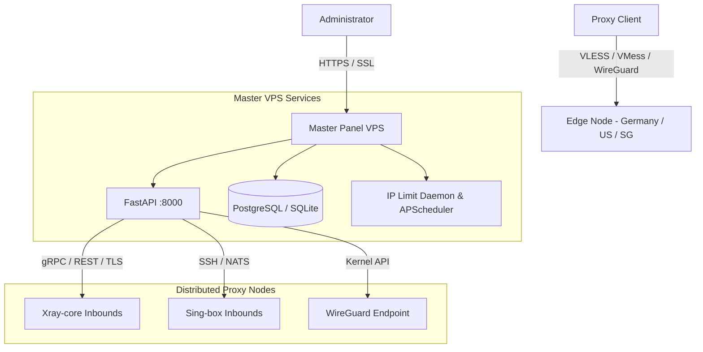

<p align="center">
  <a href="https://github.com/baglanemelian/pasarguard" target="_blank" rel="noopener noreferrer">
    <picture>
      <source media="(prefers-color-scheme: dark)" srcset="https://github.com/PasarGuard/PasarGuard.github.io/raw/main/public/logos/PasarGuard-white-logo.png">
      
    </picture>
  </a>
</p>

<h1 align="center">🛡️ PasarGuard — Linux VPS Proxy Orchestration Platform</h1>

<p align="center">
  <strong>High-performance, censorship-resistant multi-node proxy orchestration suite engineered exclusively for Linux production servers (Ubuntu / Debian / AlmaLinux).</strong>
</p>

<p align="center">
  <a href="https://github.com/baglanemelian/pasarguard"></a>
  <a href="https://github.com/baglanemelian/pasarguard"></a>
  <a href="https://github.com/baglanemelian/pasarguard"></a>
  <a href="https://github.com/baglanemelian/pasarguard"></a>
  <a href="https://github.com/baglanemelian/pasarguard"></a>
  <a href="https://github.com/baglanemelian/pasarguard"></a>
  <a href="https://github.com/baglanemelian/pasarguard/blob/main/LICENSE"></a>
</p>

<p align="center">
  <a href="./README-fa.md">🇮🇷 فارسی</a> •
  <a href="./README-zh-cn.md">🇨🇳 简体中文</a> •
  <a href="./README-ru.md">🇷🇺 Русский</a>
</p>

<p align="center">
  
</p>

---

## 📋 Table of Contents

- [📖 Overview](#-overview)
- [✨ Key Capabilities & Protocol Support](#-key-capabilities--protocol-support)
- [💎 Production Enhancements in this Fork](#-production-enhancements-in-this-fork)
- [🖥️ Linux VPS Requirements](#️-linux-vps-requirements)
- [🚀 VPS Installation & Deployment Guide](#-vps-installation--deployment-guide)
  - [Method 1: One-Line Automated Linux VPS Installer (Recommended)](#method-1-one-line-automated-linux-vps-installer-recommended)
  - [Method 2: Docker & Docker Compose VPS Deployment](#method-2-docker--docker-compose-vps-deployment)
  - [Method 3: Manual Source Installation & Systemd Service](#method-3-manual-source-installation--systemd-service)
- [🔒 Production SSL / TLS Domain Setup (Nginx + Certbot)](#-production-ssl--tls-domain-setup-nginx--certbot)
- [🔑 First-Time Setup & Admin Account Provisioning](#-first-time-setup--admin-account-provisioning)
- [🛡️ Advanced Security & Traffic Management](#️-advanced-security--traffic-management)
  - [Concurrent Multi-IP Limiter (UUID Enforcement)](#concurrent-multi-ip-limiter-uuid-enforcement)
  - [Reseller & Sub-Admin User Quotas](#reseller--sub-admin-user-quotas)
  - [Telegram Bot Real-Time Monitoring & Alerts](#telegram-bot-real-time-monitoring--alerts)
- [🌐 Multi-Node Distributed Architecture](#-multi-node-distributed-architecture)
- [⚙️ Production Configuration Reference (.env)](#️-production-configuration-reference-env)
- [⌨️ Linux CLI Command Reference](#️-linux-cli-command-reference)
- [🛠️ Maintenance, Service Control & Logs](#️-maintenance-service-control--logs)
- [❓ Troubleshooting & Linux FAQ](#-troubleshooting--linux-faq)
- [🤝 Contributing](#-contributing)
- [📄 License](#-license)

---

## 📖 Overview

**PasarGuard** is a production-grade, distributed proxy orchestration platform purpose-built for Linux VPS environments. It allows network administrators and service providers to manage, monitor, and scale proxy services across global server clusters through an intuitive web interface and fully automated REST APIs.

Designed to operate under aggressive network censorship, PasarGuard coordinates multiple high-speed proxy cores (**Xray-core**, **Sing-box**, and **WireGuard**) while providing strict access limits, real-time client traffic policing, and multi-tenant reseller infrastructure.

---

## ✨ Key Capabilities & Protocol Support

<table>
  <tr>
    <td width="50%">
      <h3>🔒 Multi-Core Protocol Support</h3>
      Native orchestration of <b>Xray-core</b>, <b>Sing-box</b>, and <b>WireGuard</b>. Deploy <code>VLESS</code>, <code>VMess</code>, <code>Trojan</code>, <code>Shadowsocks</code>, <code>Hysteria 2</code>, and <code>TUIC</code>.
    </td>
    <td width="50%">
      <h3>⚡ Real-Time Concurrent IP Limiting</h3>
      Automated background enforcement that terminates client sessions exceeding their allowed concurrent IP threshold, preventing multi-device link sharing.
    </td>
  </tr>
  <tr>
    <td width="50%">
      <h3>👥 Multi-Tenant Reseller Quotas</h3>
      Granular Role-Based Access Control (RBAC). Allocate strict user creation limits (<code>max_users</code>) to resellers and isolate client records across sub-admins.
    </td>
    <td width="50%">
      <h3>📊 Live Sub-Second Telemetry</h3>
      Real-time bandwidth throughput, CPU/RAM/Disk metrics, active TCP/UDP connections, node latencies, and historical traffic consumption graphs.
    </td>
  </tr>
  <tr>
    <td width="50%">
      <h3>🔗 Universal Subscription Routing</h3>
      Generates dynamic client configuration links and QR codes compatible with <b>V2rayNG</b>, <b>Clash Meta / Mihomo</b>, <b>Sing-box</b>, <b>Shadowrocket</b>, and <b>Streisand</b>.
    </td>
    <td width="50%">
      <h3>🤖 Telegram Bot & Webhook Automations</h3>
      Automated backup dispatch, threshold warnings (80%/100% traffic used), node outage alerts, and subscription renewal notices straight to Telegram.
    </td>
  </tr>
</table>

---

## 💎 Production Enhancements in this Fork

This repository incorporates mission-critical enhancements for production Linux deployments:

- [x] **Concurrent IP Multi-Device Limiter (`uuid_limit`):** Integrated database schema migrations, UI inputs in user creation/edit forms, and an active background scanner (`ip_limit_checker.py`) that monitors multi-IP abusers.
- [x] **Sub-Admin / Reseller Quota Enforcement (`max_users`):** Strict backend quota checks preventing resellers from provisioning users beyond their assigned allowance.
- [x] **Linux Systemd Service Automations:** Native systemd process management with automatic crash restarts and journal logging (`install_service.sh`).
- [x] **FastAPI & React 19 Stack Optimization:** Enhanced response latency, optimized database connection pooling, and sub-second metrics aggregation.

---

## 🖥️ Linux VPS Requirements

| Specification | Minimum (Single Node) | Recommended (Multi-Node / High Volume) |
|---|---|---|
| **Operating System** | Ubuntu 22.04 LTS / Debian 12 | Ubuntu 24.04 LTS / Debian 12 / AlmaLinux 9 |
| **CPU** | 1 vCPU (x86_64 or ARM64) | 2–4 vCPU |
| **RAM** | 1 GB RAM | 2 GB – 4 GB RAM |
| **Disk Storage** | 10 GB SSD | 25 GB+ NVMe SSD |
| **Network** | 1 Gbps port, Public Static IPv4 | 1 Gbps – 10 Gbps port, Static IPv4 + IPv6 |
| **Firewall Ports** | `80` (HTTP), `443` (HTTPS), `8000` (Panel API) | Open inbound ports as required by proxy protocols |

---

## 🚀 VPS Installation & Deployment Guide

Choose from three distinct deployment strategies depending on your operational preferences:

---

### Method 1: One-Line Automated Installer (Recommended)

A single command that handles **everything** — installs all system dependencies (`uv`, `bun`, `git`), clones the repository, installs Python & JavaScript packages, runs database migrations, compiles the frontend dashboard, registers a `systemd` service, opens the firewall, and generates your first admin setup key.

#### Step 1: Connect to your Linux VPS
```bash
ssh root@YOUR_SERVER_IP
```

#### Step 2: Run One Single Command
```bash
sudo bash -c "$(curl -fsSL https://raw.githubusercontent.com/baglanemelian/pasarguard/main/install.sh)"
```

> **That's it.** After ~2–3 minutes, the installer will print your panel URL and admin setup key:

```text
================================================================
      PASARGUARD INSTALLATION COMPLETED SUCCESSFULLY!
================================================================
Access your panel dashboard:
  👉  http://YOUR_SERVER_IP:8000/dashboard/
  👉  http://YOUR_SERVER_IP:8000/docs (Swagger REST API)

Administrator Setup Key:
  pg_setup_7b29a8f4c1e0   (valid for 15 minutes)

Service Management Commands:
  - Status:   sudo systemctl status pasarguard
  - Restart:  sudo systemctl restart pasarguard
  - Logs:     sudo journalctl -u pasarguard -f
================================================================
```

#### Step 3: Verify the Running Service
```bash
systemctl status pasarguard
```

> 💡 **Updating to latest version?** Simply run the same command again — it will pull the latest code, re-run migrations, rebuild the dashboard, and restart the service automatically.

---

### Method 2: Docker & Docker Compose VPS Deployment

For containerized deployments with full isolation:

#### Step 1: Install Docker Engine on Linux
```bash
curl -fsSL https://get.docker.com | sh
sudo systemctl enable --now docker
```

#### Step 2: Clone the Repository to `/opt/pasarguard`
```bash
git clone https://github.com/baglanemelian/pasarguard.git /opt/pasarguard
cd /opt/pasarguard
```

#### Step 3: Configure Environment Variables
```bash
cp .env.example .env
nano .env
```
*(Verify your `UVICORN_HOST = "0.0.0.0"`, `UVICORN_PORT = 8000`, and set a strong `JWT_SECRET_KEY`).*

#### Step 4: Start the Container Stack
```bash
docker compose up -d
```

#### Step 5: Check Container Status & Logs
```bash
docker compose ps
docker compose logs -f
```

---

### Method 3: Manual Source Installation & Systemd Service

Deploy directly from source on Ubuntu/Debian using the high-speed `uv` Python package manager:

#### Step 1: Install Python, uv, Build Tools & Bun
```bash
sudo apt update
sudo apt install -y python3 python3-pip curl wget git build-essential

# Install uv (Fast Python Package Manager)
curl -LsSf https://astral.sh/uv/install.sh | sh
source ~/.cargo/env

# Install Bun (JavaScript Runtime for Dashboard)
curl -fsSL https://bun.sh/install | bash
source ~/.bashrc
```

#### Step 2: Clone the Repository
```bash
git clone https://github.com/baglanemelian/pasarguard.git /opt/pasarguard
cd /opt/pasarguard
```

#### Step 3: Install Python Dependencies & Run Migrations
```bash
cp .env.example .env
uv sync
uv run alembic upgrade head
```

#### Step 4: Compile Frontend Dashboard Assets
```bash
chmod +x build_dashboard.sh
./build_dashboard.sh
```

#### Step 5: Register and Enable Systemd Service
Use the provided `install_service.sh` script:
```bash
chmod +x install_service.sh
sudo ./install_service.sh
sudo systemctl enable --now pasarguard
```

Verify service execution:
```bash
sudo systemctl status pasarguard
```

---

## 🔒 Production SSL / TLS Domain Setup (Nginx + Certbot)

For security, the administration dashboard should always be served over HTTPS behind an Nginx reverse proxy.

### 1. Install Nginx and Certbot
```bash
sudo apt install -y nginx certbot python3-certbot-nginx
```

### 2. Configure Nginx Server Block
Create `/etc/nginx/sites-available/pasarguard`:
```nginx
server {
    server_name panel.yourdomain.com;

    location / {
        proxy_pass http://127.0.0.1:8000;
        proxy_set_header Host $host;
        proxy_set_header X-Real-IP $remote_addr;
        proxy_set_header X-Forwarded-For $proxy_add_x_forwarded_for;
        proxy_set_header X-Forwarded-Proto $scheme;

        # WebSocket & Streaming support
        proxy_http_version 1.1;
        proxy_set_header Upgrade $http_upgrade;
        proxy_set_header Connection "upgrade";
    }
}
```

Enable site:
```bash
sudo ln -s /etc/nginx/sites-available/pasarguard /etc/nginx/sites-enabled/
sudo nginx -t && sudo systemctl reload nginx
```

### 3. Obtain Free Let's Encrypt SSL Certificate
```bash
sudo certbot --nginx -d panel.yourdomain.com
```

### 4. Configure UFW Firewall
```bash
sudo ufw allow 22/tcp
sudo ufw allow 80/tcp
sudo ufw allow 443/tcp
sudo ufw enable
```

---

## 🔑 First-Time Setup & Admin Account Provisioning

When you first launch PasarGuard on your Linux VPS, you need to create the primary **Owner (Superadmin)** account.

### Step 1: Generate a One-Time Setup Key via CLI

Run the CLI command on your server:

**Native Linux / Systemd:**
```bash
cd /opt/pasarguard
uv run python pasarguard-cli.py generate-temp-key
```

**Docker Container:**
```bash
docker compose exec pasarguard pasarguard-cli generate-temp-key
```

Output:
```text
==================================================
  PasarGuard Setup Key:  pg_setup_7b29a8f4c1e0
  Expires in: 15 minutes
==================================================
```

### Step 2: Complete Account Creation in Browser
1. Open your browser and navigate to:
   ```
   https://panel.yourdomain.com/dashboard/
   ```
   *(or `http://YOUR_SERVER_IP:8000/dashboard/` if accessed directly).*
2. On the login screen, click **"Setup with Key"** and enter the generated key.
3. Set your master **Username** and **Password**.
4. You are immediately logged in as the master **Owner**.

---

## 🛡️ Advanced Security & Traffic Management

### Concurrent Multi-IP Limiter (UUID Enforcement)
Prevent clients from sharing subscriptions across multiple unauthorized devices:
1. Go to **Users** ➔ Click **Create User** (or Edit).
2. Under the **IP Limit** field, specify the maximum number of concurrent IP addresses allowed (e.g., `1` for single-device, `2` for dual-device).
3. The background inspection worker automatically queries active proxy core sessions, isolates duplicate IP addresses connecting with the same UUID, and revokes access for violators.

### Reseller & Sub-Admin User Quotas
Scale your infrastructure across delegated resellers:
1. Navigate to **Admins** ➔ **Create Admin**.
2. Assign the **Reseller** role.
3. Configure the **User Limit (`max_users`)** (e.g., `100`).
4. The reseller can log into the dashboard, create users, and inspect their traffic up to their allotted quota, with zero access to system settings or other admins' users.

### Telegram Bot Real-Time Monitoring & Alerts
1. Open **Settings** ➔ **Telegram**.
2. Enter your `Telegram Bot Token` and `Admin Chat ID`.
3. Receive automated alerts for:
   - Node offline / disconnect warnings
   - High server resource usage (CPU/RAM spikes)
   - Automated daily database backups (.sqlite / sql dump)
   - User traffic expiration warnings

---

## 🌐 Multi-Node Distributed Architecture

PasarGuard operates seamlessly with distributed edge nodes located in different regions:



To add an Edge Node:
1. Open **Nodes** ➔ **Add Node**.
2. Enter the remote server IP, port, and security token.
3. The master panel automatically deploys configurations and aggregates traffic statistics in real-time.

---

## ⚙️ Production Configuration Reference (.env)

| Variable | Default Value | Description |
|---|---|---|
| `UVICORN_HOST` | `0.0.0.0` | Network interface to bind (use `127.0.0.1` behind reverse proxy) |
| `UVICORN_PORT` | `8000` | Application listening port |
| `ROLE` | `all-in-one` | Server role: `all-in-one`, `master`, or `node` |
| `DEBUG` | `False` | Set `False` in production to prevent stack traces |
| `DOCS` | `True` | Exposes interactive Swagger documentation at `/docs` |
| `SQLALCHEMY_DATABASE_URL` | `sqlite+aiosqlite:///db.sqlite3` | Database connection string (SQLite, PostgreSQL, TimescaleDB) |
| `JWT_SECRET_KEY` | *(Random String)* | Secret key used for signing administrative JWT tokens |
| `ACCESS_TOKEN_EXPIRE_MINUTES`| `1440` | Admin token lifetime in minutes (24 hours) |
| `ALLOWED_ORIGINS` | `*` | Allowed CORS origins (lock down to your domain in production) |
| `DASHBOARD_PATH` | `/dashboard/` | URL subpath where the web dashboard is served |

---

## ⌨️ Linux CLI Command Reference

Execute management tasks directly from the Linux terminal:

```bash
# Generate temporary setup key for owner account
python pasarguard-cli.py generate-temp-key

# Check installed PasarGuard version
python pasarguard-cli.py version

# Run pending database migrations
uv run alembic upgrade head

# Rebuild frontend dashboard
./build_dashboard.sh
```

---

## 🛠️ Maintenance, Service Control & Logs

Manage the systemd background daemon on Linux:

```bash
# Start service
sudo systemctl start pasarguard

# Stop service
sudo systemctl stop pasarguard

# Restart service
sudo systemctl restart pasarguard

# View service status
sudo systemctl status pasarguard

# Follow live service logs in real time
sudo journalctl -u pasarguard -f

# View last 100 log entries
sudo journalctl -u pasarguard -n 100 --no-pager
```

---

## ❓ Troubleshooting & Linux FAQ

<details>
<summary><b>1. Port 8000 is already occupied by another service</b></summary>
Find which process is using port 8000:
```bash
sudo ss -tulpn | grep :8000
```
Change `UVICORN_PORT = 8080` in `/opt/pasarguard/.env` and restart:
```bash
sudo systemctl restart pasarguard
```
</details>

<details>
<summary><b>2. Database schema migration issues</b></summary>
Apply any pending database migrations manually:
```bash
cd /opt/pasarguard
uv run alembic upgrade head
```
</details>

<details>
<summary><b>3. Firewall is blocking access to dashboard</b></summary>
Allow traffic on port 8000 through the UFW firewall:
```bash
sudo ufw allow 8000/tcp
sudo ufw reload
```
</details>

<details>
<summary><b>4. How to reset a forgotten admin password?</b></summary>
Generate a new one-time setup key via the server CLI:
```bash
cd /opt/pasarguard
uv run python pasarguard-cli.py generate-temp-key
```
Open `https://panel.yourdomain.com/dashboard/` and reset your credentials using the key.
</details>

---

## 🤝 Contributing

Contributions, bug reports, and pull requests are welcomed!  
Please open issues on [GitHub Issues](https://github.com/baglanemelian/pasarguard/issues).

---

## 📄 License

This project is licensed under the [MIT License](LICENSE).  
Engineered for open, uncensored, and secure global communication.
